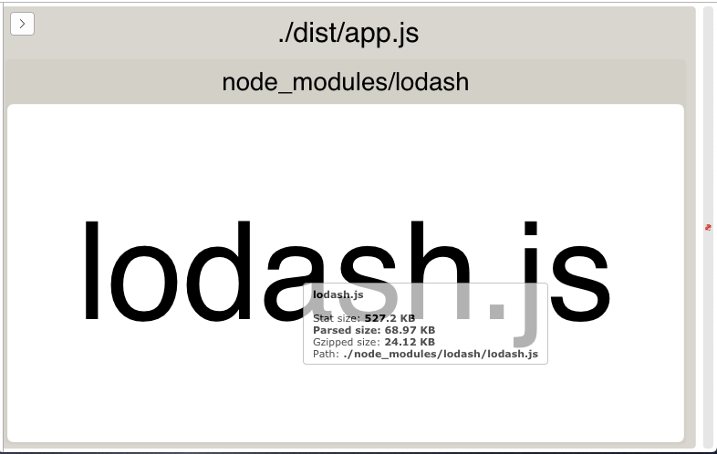
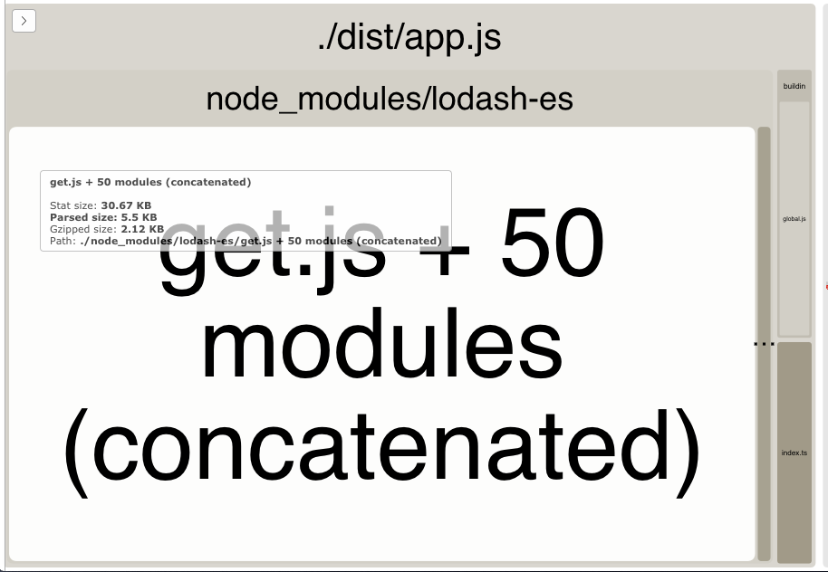
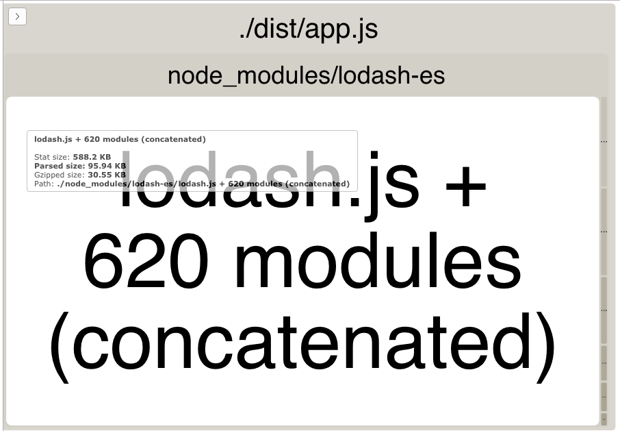
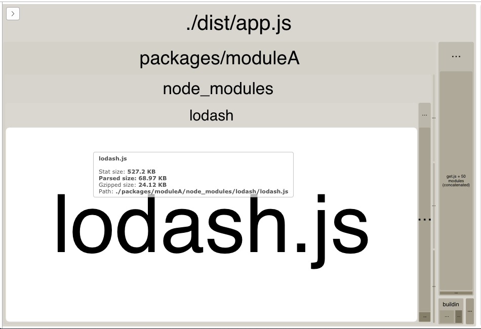
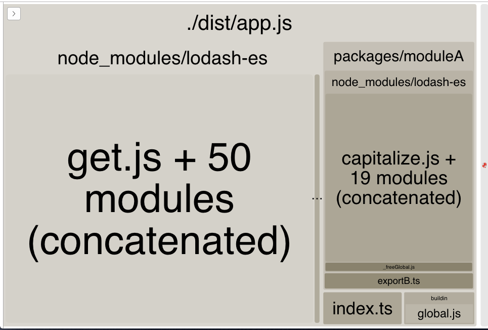
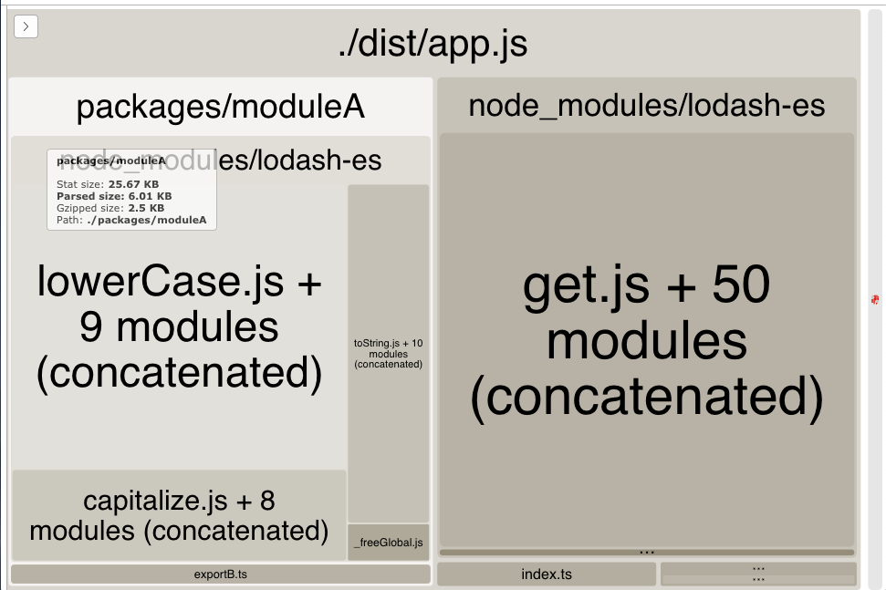

# Webpack Tree Shaking Demystified

This is a simple prototype project to clarify/illustrate how tree-shaking works in Webpack.

There is a lot of general documentation on how to use tree-shaking, but not many specific guidelines on how to use it - and in particular notes about limitations.

## tl;dr:
I was expecting way too much of tree shaking - it works, but I was expecting way too much magic.

See: https://twitter.com/dan_abramov/status/841258118810075138

## The setup
Imagine an application is built via webpack (production mode enabled) that has it's own dependencies and pulls in other modules that in turn have their own dependencies.  The main webpack application doesn't use all modules/functions in the imported library.

Webpack should be tree-shaking to remove any code that is not actually used, and furthermore not including any dependencies of code that is unused.

I'm using lodash as an example third-party application here because it's huge, but in most cases applications are often only using tiny parts of it. I did quick attempts at other libraries like Redux and Moment with similar results.

I've used [webpack-bundle-analyzer](https://www.npmjs.com/package/webpack-bundle-analyzer) in the steps below to show the resulting package from each step.

## Step 1

Let's start with a dead simple index.ts file that looks like this:

```typescript
import { get } from 'lodash';
const anObject = { foo: 'bar' };
console.log(get(anObject, 'foo')); // bar
```

One might assume that some magic could happen here to pull only what's needed from lodash and decrease the size of your bundle - this is not the case:



Pulling in 500KB of code just to use the get function is not going to work, so let's move onto Step 2

## Step 2

The default bundling of lodash doesn't allow for tree-shaking, hence the existence of: https://www.npmjs.com/package/lodash-es.

We update our simple index file to do this:

```typescript
import get from 'lodash-es/get';

const anObject = { foo: 'bar' };
console.log(get(anObject, 'foo')); // bar
```

And we get way better results - overall bundle size drops from 70K to 6K and we can see only the get function is included in the result.



However, one note/caveat here that I'll get more into later.  Changing the import above to this:

```typescript
import { get } from 'lodash-es';
```

And suddenly the bundle is even bigger than with the 'lodash' package :(



## Step 3

Next let's pull in an external module (i.e. another internal Bb library), that also uses lodash.

Package ModuleA contains the following 2 files:

`exportA.ts` (a developer has incorrectly imported the entire lodash library for usage as _)

```typescript
import * as _ from 'lodash';

export const includeAllTheThingsFromLodash = () => console.log(_.camelCase('this is a test'));
```

`exportB.ts`

```typescript
import capitalize from 'lodash-es/capitalize';

export const includeOnlyUsedFunctionFromLodash = () => console.log(capitalize('this is a test'));
```

`index.ts`

```typescript
export * from './exportA';
export * from './exportB';
```

And we update our code in our primary package index to look like this:

```typescript
import get from 'lodash-es/get';
import { includeOnlyUsedFunctionFromLodash } from 'moduleA'

const anObject = { foo: 'bar' };
console.log(get(anObject, 'foo'));
includeOnlyUsedFunctionFromLodash();
```

And we end up with a mess.  Even though we're not explicitly pulling in the module that pulls in the whole lodash library, it's still included in the bundle.  The generated bundle also includes the `includeAllTheThingsFromLodash` function even though it's not used at all.

And because lodash-es is also in use, we have the code for get and capitalize in the bundle 2x.



**key takeaway here**:  it seems that when an index file is used to merge all exports and allow for the import from syntax with no sub-path - webpack will automatically include all exports in the index.ts in the package.

If we update to this:

```typescript
import get from 'lodash-es/get';
import { includeOnlyUsedFunctionFromLodash } from 'moduleA/exportA'

const anObject = { foo: 'bar' };
console.log(get(anObject, 'foo'));
includeOnlyUsedFunctionFromLodash();
```

And we're back to a much more reasonable bundle size of 9K, and the resulting package does not include the includeAllTheThingsFromLodash function or it's lodash dependency.



## One last thing

Just to confirm a hunch, let's update moduleA/exportB.ts to be:

```typescript
import capitalize from 'lodash-es/capitalize';
import lowerCase from 'lodash-es/lowerCase';

export const includeOnlyUsedFunctionFromLodash = () => console.log(capitalize('this is a test'));

export const anotherFunctionThatMightNotBeUsed = () => console.log(lowerCase('THIS WILL BE LOWERCASE'));
```

We rebuild the parent application and find this:



`lowerCase` is included in the bundle even though the function that used it is not used by our code.


## Takeaways
* As far as I can tell, the concept of a central index file for merging module exports can not/should not be used with webpack, as it leads to including way too much in the final bundle
* Be very aware of the libraries you're pulling into your projects, and use libraries that fully support es6 modules where possible. If that's not available - tree shaking doesn't help and the library will just be pulled in as a whole
* When writing modular code, the key point we need to remember is creating lots of small modules with a discrete purpose.  
  * If any exported member of a module is used, the entire module is pulled in to the bundle. i.e.: If a "utilities" module has many functions that exist in a single module file (along with dependencies for those functions), this will mean your bundle will include all of that code and dependencies even if you just use a 2-line utility function.
